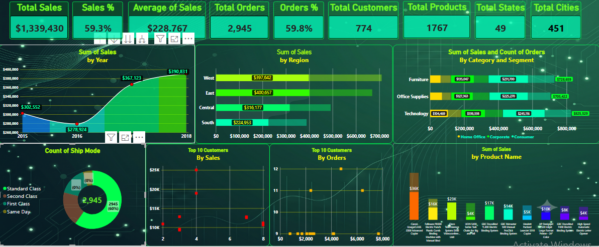
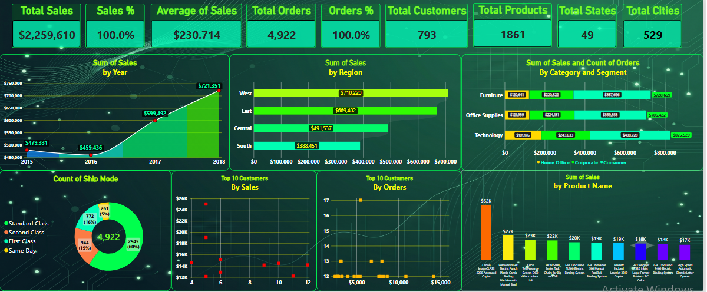
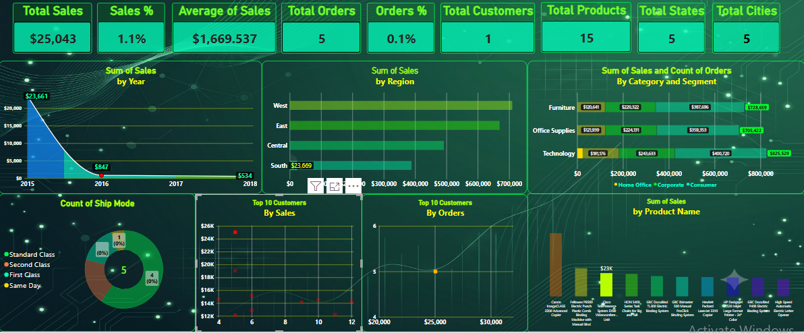
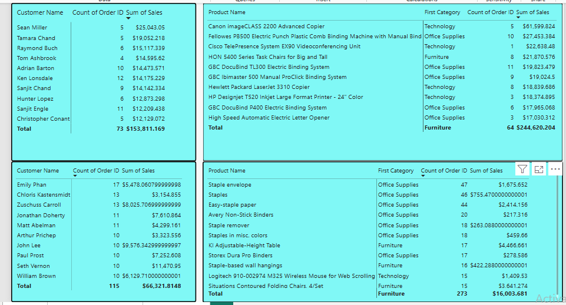

# Sales-Performance-Forecasting-Dashboard-by-Power-BI

A Power BI project analyzing four years of sales data to uncover sales trends, order patterns, product and customer performance, geographic distribution, shipping preferences, and seasonal sales patterns, with an estimated sales outlook for 2019.

## Project Overview

This project analyzes sales data covering the period from **2015 to 2018** using Microsoft Power BI.

The analysis explores overall sales and order performance, customer and product behavior, geographic markets, customer segments, shipping methods, and recurring monthly and quarterly sales patterns.

Historical sales trends and recurring seasonal patterns were also used to estimate the expected sales performance for **2019**.

## Project Objective

The objective of this project is to analyze sales data and identify meaningful patterns and trends that can help evaluate sales performance and support data-driven decision-making.

The analysis focuses on:

* Sales performance
* Order volume
* Product performance
* Customer performance
* Geographic markets
* Customer segments
* Shipping methods
* Seasonal sales patterns
* Year-over-year sales growth
* 2019 sales expectations

## Dashboard Preview

### Sales Dashboard 

### Product Analysis 

## Key KPIs

| KPI             |     Value |
| --------------- | --------: |
| Total Sales     | 2,259,610 |
| Total Orders    |     4,922 |
| Total Customers |       793 |
| Total Products  |     1,861 |
| Total States    |        49 |
| Total Cities    |       529 |

## Dataset Overview

| Attribute           | Details                                             |
| ------------------- | --------------------------------------------------- |
| Sales Period        | 2015–2018                                           |
| Categories          | Furniture, Office Supplies, Technology              |
| Customer Segments   | Home Office, Corporate, Consumer                    |
| Shipping Methods    | Standard Class, Second Class, First Class, Same Day |
| Geographic Coverage | 49 States and 529 Cities                            |

## Key Insights

### Sales Performance

* **2018** was the highest-performing sales year, generating **721,351** in sales and representing **31.9% of total sales**.
* 2018 also recorded the highest number of orders, with **1,661 orders**, representing **33.7% of total orders**.
* The **West region** generated the highest share of sales, accounting for **31.4%**.
* **Technology** was the highest-selling category, contributing **36.5% of total sales**.
* The **Consumer** segment generated the highest share of sales, accounting for **50.8%**.
* **Standard Class** generated the highest share of sales among shipping methods, accounting for **59.3%**.

### Order Analysis

* **2018** recorded the highest number of orders, with **1,661 orders**.
* The **West region** recorded the highest share of orders, accounting for **31.2%**.
* **Consumer** recorded the highest share of orders, accounting for **51.5%**.

### Product Analysis

The analysis showed that the **10 best-selling products were not the same as the 10 most-ordered products**.

This highlights the difference between **sales value and order volume**, as products with fewer orders can generate significantly higher sales depending on their individual value.

### Customer Analysis

The analysis also showed that the **10 highest-selling customers were not the same as the 10 most-ordered customers**.

This distinction demonstrates that a higher number of orders does not necessarily correspond to higher total sales value.

## Four-Year Sales Analysis

| Year | Total Sales |
| ---- | ----------: |
| 2015 |     479,331 |
| 2016 |     459,436 |
| 2017 |     599,492 |
| 2018 |     721,351 |

### Key Trends

* **2015** recorded the lowest annual sales, while **2018** recorded the highest.
* **Q1** consistently recorded the lowest sales across the four-year period.
* **Q4** consistently recorded the highest sales.
* Sales showed noticeable increases during **March, September, November, and December**.
* **February** recorded the lowest monthly sales, followed by **January**.
* Sales increased consistently during **November and December**, highlighting a recurring seasonal pattern.
* Sales in **Q2** during the first two years were nearly identical.
* Q2 sales increased during the later years, while **2017 and 2018 remained relatively close** in Q2 performance.
* **October** sales remained relatively stable during the first two years.

## Year-over-Year Sales Growth

| Year | Sales Growth |
| ---- | -----------: |
| 2016 |       -4.15% |
| 2017 |      +30.48% |
| 2018 |      +20.33% |

The results indicate an overall upward trend in sales despite the decline recorded in **2016**.

## 2019 Sales Forecast

Based on the historical sales patterns observed between **2015 and 2018**, sales are expected to continue growing in 2019.

Higher sales activity is particularly expected during:

* **March — Q1**
* **September — Q3**
* **November — Q4**
* **December — Q4**

This estimated outlook is based on historical sales trends, recurring seasonal patterns, and the overall sales performance observed during the four-year period.

## Tools & Technologies

* **Microsoft Power BI**
* **DAX**
* **Microsoft Excel**
* **Data Analysis**
* **Data Visualization**
* **Sales Forecasting**

## Project Files

| File    | Description                       |
| ------- | --------------------------------- |
| `.pbix` | Interactive Power BI dashboard    |
| `.pdf`  | Detailed sales analysis report    |
| Dataset | Source data used for the analysis |

## Conclusion

The analysis revealed an overall upward sales trend over the four-year period, with **2018 recording the highest sales and order performance**.

The results also highlighted differences in sales performance across **regions, product categories, customer segments, shipping methods, products, and customers**.

In addition, the analysis identified recurring seasonal patterns, with **Q4 consistently recording the strongest sales performance** and increased activity observed during several key months.

These findings provide a comprehensive view of historical sales performance and support the estimated sales outlook for **2019**.

## Project Repository

Explore the complete project, including the **Power BI dashboard and detailed analysis report**, in this repository.
